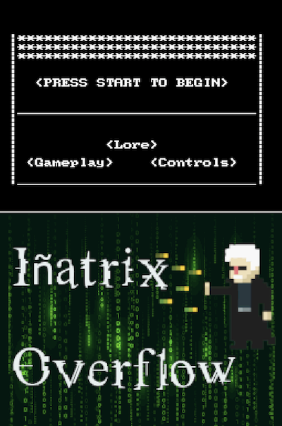

# Iñatrix Overflow 🎮

Es un juego que hemos decidido desarrollar en honor a Iñaki Morlan, nuestro profesor de la asignatura de Principios de Sistemas Digitales que se jubiló este pasado Diciembre y hacia el cual hemos desarrollado un afecto bastante grande. Iñaki se convertirá en Iñatrix, el protagonista; dueño y señ̃or del mundo binario. Éste juego ha sido desarrollado para la asignatura de Estructuras de computadores.

Para más información, se pude consultar la <a href="https://github.com/Geru-Scotland/inatrix_overflow/blob/master/doc/memoria/Memoria.pdf">memoria del proyecto</a>.

  

Video demostración:

  

## Lore

Iñatrix es el super héroe que colabora analizando el sistema que tiene la función de 'realidad' en éste mundo, gracias a un exhaustivo análisis es capaz de proporcionar estabilidad con su superpoder de identificación de overflows en la estructura de Matrix. La realidad que rige éste universo, está en constante decadencia y la única manera de conseguir que no se exista un fatal system failure es eliminando los bits incongruentes de su estructura intrínseca.

Para ello, Iñatrix será capaz de duplicarse e ir identificando de raíz matricial bidimensional los bits que hacen de centro del overflow.

Pero Iñatrix todopoderoso no está solo; nosotros le ayudaremos a encontrar los bits infectos. El tiempo juega en nuestra contra; tendremos que poner en marcha nuestros cerebros para calcular lo más rápidamente posible y poder así salvar la realidad.

## Créditos

* Estamos agradecidos por la plantilla base que nos han proporcionado los profesores de la asignatura de Estructuras de computadores de la Facultad de Informática de Donostia. Dicha plantilla se puede encontrar en el directorio [/base_template/](https://github.com/Geru-Scotland/inatrix_overflow/tree/master/base_template) de este repositorio.
* Guía sugerida por los mismos, escrita por [Jaeden Amero](https://patater.com/files/projects/manual/manual.html)
